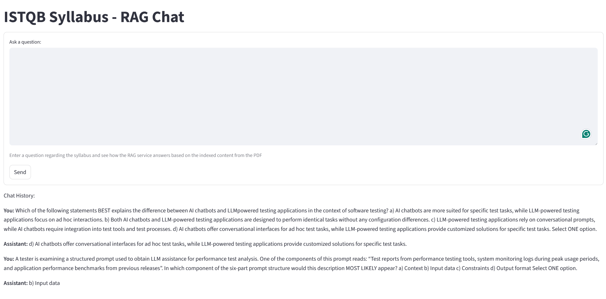

# Elasticsearch + GenAI (ISTQB)

Krótka aplikacja do wyszukiwania i generowania odpowiedzi na materiały związane z ISTQB, wykorzystująca Elasticsearch oraz modele generatywne.

- **Co robi:** indeksuje dokumenty (PDF), tworzy embeddingi i udostępnia prosty interfejs do zadawania pytań oraz generowania odpowiedzi opartych na retrieved augmented generation (RAG).
- **Główne pliki:** `main.py`, `streamlit_app.py`, folder `app/` zawiera moduły pomocnicze (ingest, embedder, retriever itp.).
- **Uruchomienie:**

```bash
pip install -r requirements.txt
streamlit run streamlit_app.py
```

Poniżej przykładowy interfejs:



Jeśli chcesz, mogę dodać więcej szczegółów (instrukcje konfiguracji Elasticsearch, zmienne środowiskowe, przykładowe komendy do ingestowania danych).

Ważne:

- **Docker:** przed uruchomieniem aplikacji upewnij się, że Docker jest uruchomiony i dostępny. Aplikacja używa Elasticsearch uruchamianego w kontenerze (możesz skorzystać z `docker-compose up -d`).
- **Baza wektorowa (indeks):** przed użyciem funkcji RAG trzeba utworzyć bazę wektorową i zaindeksować dokumenty. Aplikacja zawiera pomocniczą funkcję `create_vector_db()` w pliku `main.py`, która:

	- wczytuje plik PDF,
	- oczyszcza strony (usuwając wzorce jak numery stron, copyright itp.),
	- dzieli tekst na fragmenty (chunks),
	- tworzy embeddingi i indeksuje je w Elasticsearch (wywołuje `ingest_to_es`).

	Funkcję `create_vector_db()` możesz uruchomić na dwa sposoby:

	- bezpośrednio przez import (zalecane, bo bez uruchamiania dodatkowego kodu z `main.py`):

	```bash
	python -c "from main import create_vector_db; create_vector_db('data/syllabus_genai.pdf')"
	```

	lub w pliku Python:

	```python
	from main import create_vector_db
	create_vector_db()
	```

	- jeśli wolisz uruchomić skrypt `main.py` bez importu, sprawdź najpierw czy `main.py` nie wykonuje dodatkowych akcji w bloku `if __name__ == '__main__'` — uruchomienie `python main.py` może wtedy uruchomić demo lub inne zachowania. Najbezpieczniej użyć importu.

	Uwaga: `create_vector_db()` automatycznie wywołuje `ingest_to_es(chunks)` i zapisuje embeddingi — nie musisz wywoływać `ingest_to_es` ręcznie.

Przed uruchomieniem upewnij się, że Elasticsearch jest dostępny oraz że zmienne środowiskowe (np. `OPENAI_API_KEY`) są ustawione.

English version

# Elasticsearch + GenAI (ISTQB)

Short application for searching and generating answers from ISTQB-related materials, using Elasticsearch and generative models.

- **What it does:** indexes documents (PDF), creates embeddings, and provides a simple interface to ask questions and generate RAG-based answers.
- **Main files:** `main.py`, `streamlit_app.py`. The `app/` folder contains helper modules (`ingest`, `embedder`, `retriever`, etc.).
- **Run:**

```bash
pip install -r requirements.txt
streamlit run streamlit_app.py
```

Example UI:


Important:

- **Docker:** Make sure Docker is running. The app expects Elasticsearch available (you can use `docker-compose up -d`).
- **Vector DB (index):** Before using RAG, you need to create the vector DB and index documents. There is a helper function `create_vector_db()` in `main.py` that:

	- loads a PDF file,
	- cleans pages (removes page numbers, copyright, etc.),
	- chunks the text,
	- creates embeddings and indexes them in Elasticsearch (calls `ingest_to_es`).

	You can run `create_vector_db()` by importing it (recommended to avoid running additional demo code):

	```bash
	python -c "from main import create_vector_db; create_vector_db('data/syllabus_genai.pdf')"
	```

	or from a Python file:

	```python
	from main import create_vector_db
	create_vector_db()
	```

	Note: `create_vector_db()` calls `ingest_to_es(chunks)` internally and will index the embeddings — you don't need to call `ingest_to_es` separately.

Before running, ensure Elasticsearch is reachable and required environment variables (e.g. `OPENAI_API_KEY`) are set.
